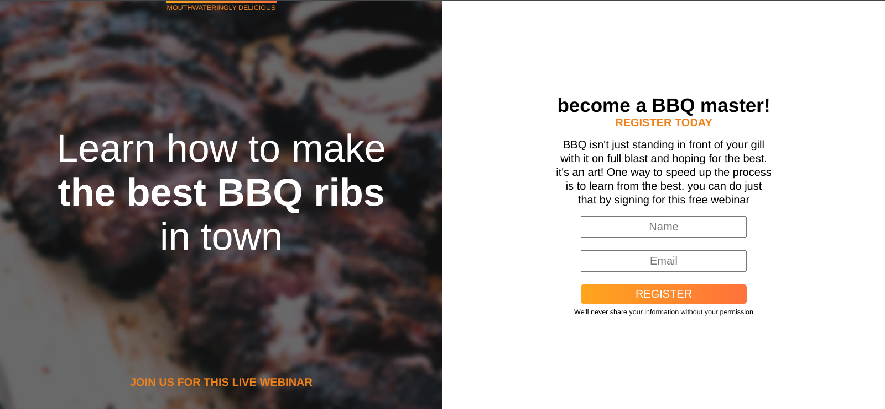
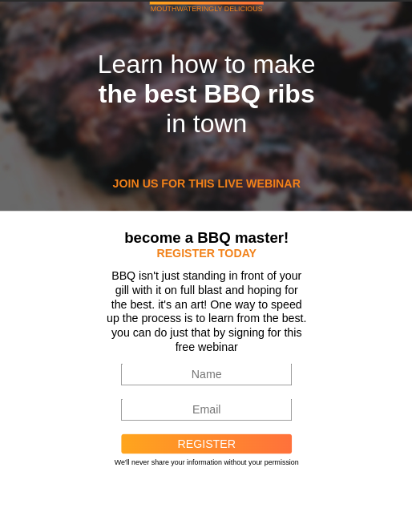

# BBQ Splash Page

A simple HTML and CSS project for a beautiful and responsive landing page for a BBQ event.

## Screenshots

    
    

## Description

This project is a demonstration of creating a splash page using HTML and CSS. It features a responsive design that adjusts to different screen sizes, making it suitable for various devices.

## Usage

1. Clone the repository to your local machine.
2. Open the `index.html` file in your web browser.
